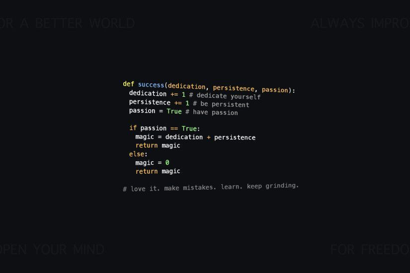

# Hola, soy Geovany 👋
### Full-stack developer · México 🇲🇽

Construyo apps de la idea al deploy. Abierto a trabajo remoto y freelance.

## 🔭 En qué ando
- Construyendo proyectos con React, Node y Python
- Explorando IA aplicada (RAG, agentes, LLMs)

## 🛠️ Stack

  
  
  
  
  
  
  

## 📫 Contacto
- LinkedIn: [tu-usuario](https://linkedin.com/in/tu-usuario)
- Correo: tu@correo.com
