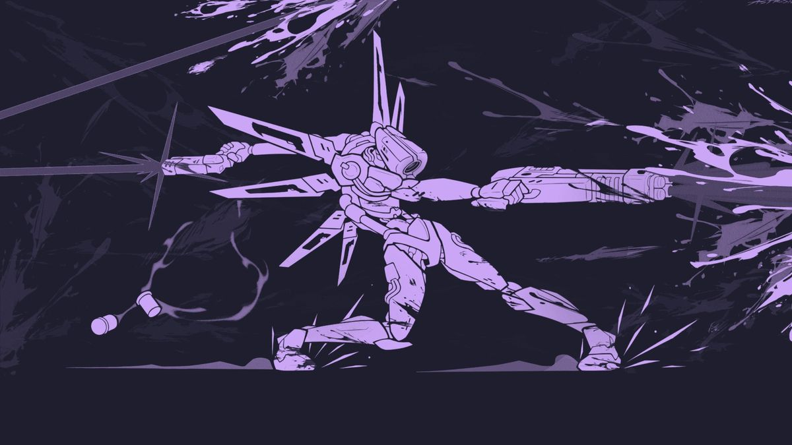

# Hola, soy Geovany 👋

### Full-stack developer · México

Construyo apps de la idea al deploy: interfaces con React, APIs con Node y Python, y herramientas con IA aplicada.
**Abierto a trabajo remoto y proyectos freelance.**

 

---

## ⭐ Proyectos destacados

<table>
  <tr>
    <td colspan="3" valign="top">
      
        
      <strong>🛒 <a href="https://github.com/CiberThanatos16/POS360">POS360</a></strong>
        
      Punto de venta de escritorio pensado para pequeños negocios en México.
        
      
      
      
      <!-- Cuando tengas una captura, súbela a /assets y descomenta:
        
      
      -->
    </td>
  </tr>
  <tr>
    <td width="33%" valign="top">
      <strong>🔄 <a href="https://github.com/CiberThanatos16/Rayder">Rayder</a></strong>
        
      Dashboard tipo pipeline para gestionar flujos de tareas repetibles por proyecto.
        
      
      
      
    </td>
    <td width="33%" valign="top">
      <strong>🌙 <a href="https://github.com/CiberThanatos16/Night-Veil">Night Veil</a></strong>
        
      <!-- TODO: escribe una línea sobre qué hace Night Veil -->
      Escribe aquí qué hace Night Veil.
        
      
      
    </td>
    <td width="33%" valign="top">
      <strong>💰 <a href="https://github.com/CiberThanatos16/el-capital">El Capital</a></strong>
        
      Gestor de finanzas personales.
        
      
      
      
    </td>
  </tr>
</table>

### 📂 Otros proyectos

<!-- TODO: completa descripción y tecnologías de cada uno antes de subir -->

| Proyecto | Descripción | Tecnologías |
|---|---|---|
| [fotosguay](https://github.com/CiberThanatos16/fotosguay) | Descripción corta | Tecnologías |
| [AbbadonBlog](https://github.com/CiberThanatos16/AbbadonBlog) | Descripción corta | Tecnologías |
| [MinecraftApp](https://github.com/CiberThanatos16/MinecraftApp) | Descripción corta | Tecnologías |
| [CrispinMod](https://github.com/CiberThanatos16/CrispinMod) | Descripción corta | Tecnologías |
| [Crud_Galletas](https://github.com/CiberThanatos16/Crud_Galletas) | Descripción corta | Tecnologías |

---

<h3>## 🛠️ Stack</h3>

## 🎯 Mi stack principal

  

    
    
    
    
    
  

  
  ### Frontend
  
  

    
    
    
    
    
    
    
    
  

  
  ### Backend
  
  

    
    
    
    
  

  
  ### Bases de datos
  
  

    
    
    
    
  

  
  ### Herramientas
  
  

    
    
    
    
  

---

## 🔭 En qué ando

- Construyendo proyectos de portafolio con React, Node y Python
- Explorando IA aplicada: RAG, agentes y herramientas con LLMs
- Buscando oportunidades remotas y clientes freelance

## 💼 Puedo ayudarte con

- Aplicaciones web completas (frontend + API + base de datos)
- Apps de escritorio con Electron
- Chatbots y flujos con IA sobre tus propios datos
- Sitios y landing pages para negocios

---

## 📫 Contacto

  
  
  

⚡ *Si tienes una idea, hablemos.*

